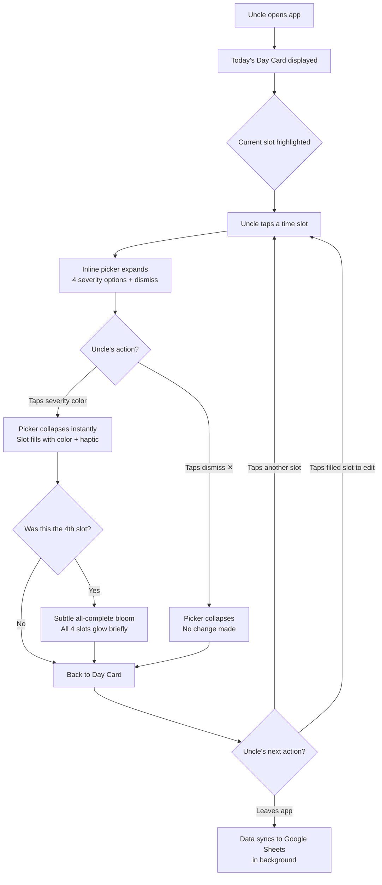
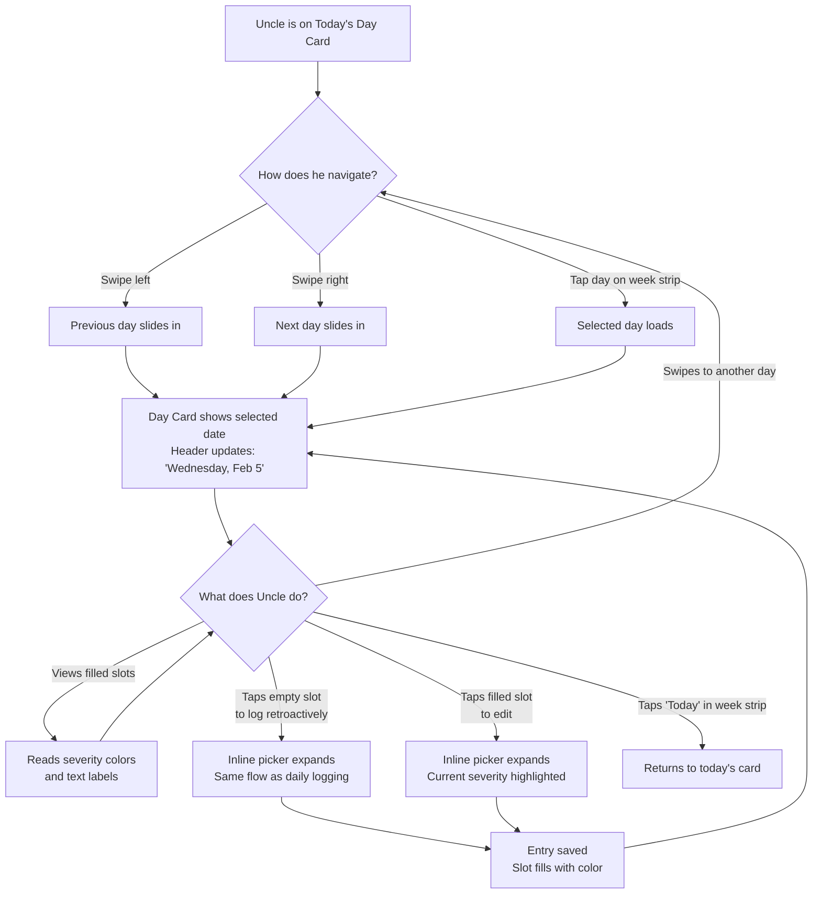
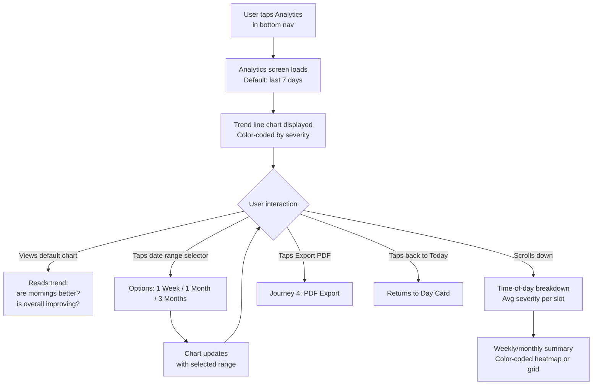
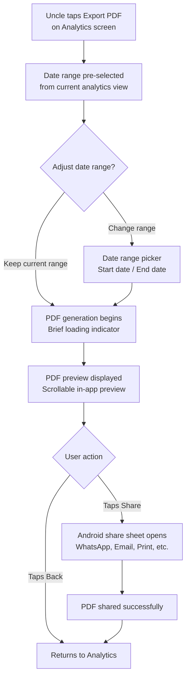
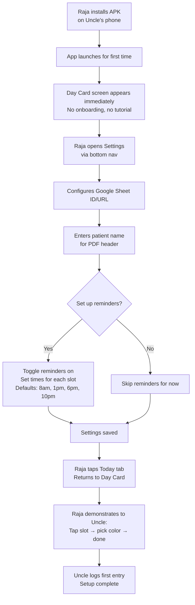
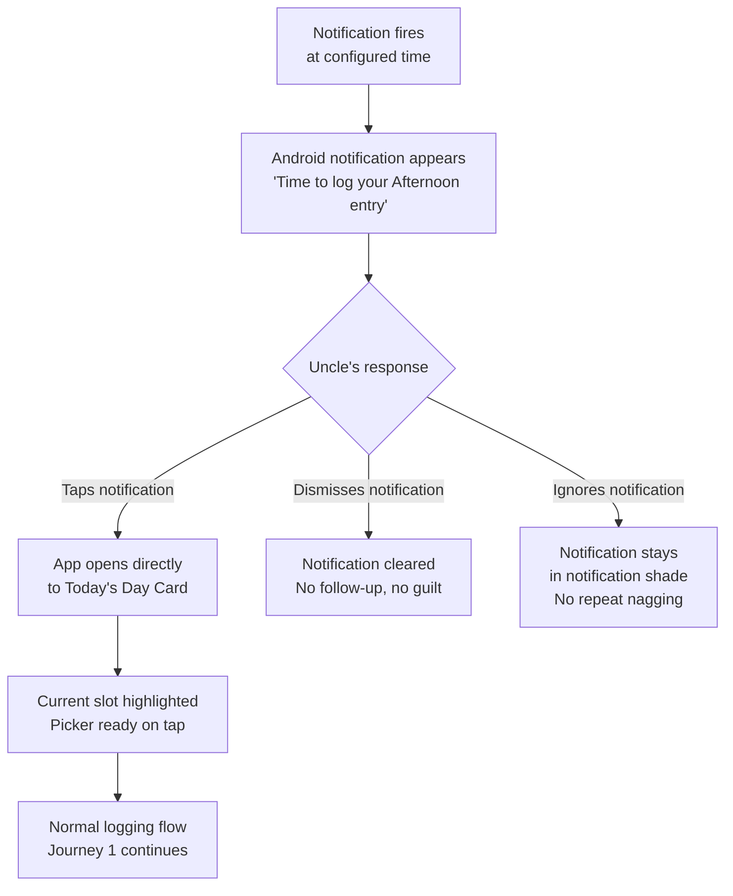

# User Journey Flows

## Journey 1: Daily Logging (Core Loop)

**Trigger:** Uncle opens the app (or taps a reminder notification)
**Goal:** Log severity for one or more time slots
**Frequency:** 1–4 times daily
**Success:** Entry saved, slot filled with color, Uncle leaves in under 5 seconds

**Key Design Decisions:**
- No confirmation after severity selection — tap = saved
- Dismiss button handles accidental slot taps without side effects
- All-complete moment is subtle (300ms bloom) — not a celebration, just acknowledgment
- Editing uses the exact same flow as new entry — tap slot, picker opens with current selection highlighted, tap different color
- Background sync happens after Uncle leaves — he never waits for it

---

## Journey 2: Day Browsing & Retroactive Logging

**Trigger:** Uncle wants to check a past day or log a missed entry
**Goal:** Navigate to a different day, view or edit entries
**Frequency:** A few times per week
**Success:** Past day viewed or edited with zero confusion about "which day am I on?"

**Key Design Decisions:**
- Week strip always shows current week with today highlighted — easy to return home
- Day header always displays the full date so Uncle never wonders "which day is this?"
- Retroactive logging is identical to live logging — no special mode, no "are you sure?" prompt
- Swiping past today shows future days as completely empty (no slots to fill for future dates — or slots present but not tappable, to maintain visual consistency)
- Swipe animation is smooth and continuous, like flipping calendar pages

---

## Journey 3: Analytics Viewing

**Trigger:** Uncle (or the son) taps the Analytics tab out of curiosity, or before a doctor visit
**Goal:** Understand severity trends over time
**Frequency:** Once a week casually, or specifically before a doctor visit
**Success:** User sees a clear trend and understands if things are improving, stable, or worsening

**Analytics Screen Layout (Top to Bottom):**
1. **Date range selector** — Chips: "1 Week" | "1 Month" | "3 Months" (default: 1 Week)
2. **Trend line chart** — X-axis: dates, Y-axis: severity (0–3 mapped to No Pain–Severe). Line color follows severity. Multiple data points per day (one per slot)
3. **Time-of-day breakdown** — Four horizontal bars or cards showing average severity for Morning, Afternoon, Evening, Night across the selected range. Answers: "which part of the day is worst?"
4. **Export button** — "Export PDF" button at the bottom, always visible

**Key Design Decisions:**
- Default to 1 week to keep the initial view relevant and not overwhelming
- Charts use the same four severity colors — visual language is consistent with Day Card
- No emotional commentary on trends — just data. No "Great week!" or "Things are getting worse"
- The time-of-day breakdown directly answers the doctor's most common question: "when is it worst?"

---

## Journey 4: PDF Export & Sharing

**Trigger:** Uncle taps "Export PDF" on the analytics screen (typically before a doctor visit)
**Goal:** Generate and share a clean PDF report
**Frequency:** Once per doctor visit (monthly or quarterly)
**Success:** PDF generated, shared via WhatsApp/email/print to the doctor

**PDF Report Contents:**
1. **Header:** Patient name (from Settings), date range, "HealthTrend Report"
2. **Trend chart:** Same line chart as analytics screen, optimized for print
3. **Time-of-day summary:** Average severity per slot across the date range
4. **Daily log table:** Date-by-date breakdown with color-coded cells
5. **Footer:** "Generated by HealthTrend on [date]"

**Key Design Decisions:**
- Date range defaults to whatever's currently selected in analytics — no re-selection friction
- PDF preview shows in-app before sharing — Uncle can see what the doctor will receive
- Share uses standard Android share sheet — WhatsApp is the likely choice
- Report is designed to be scannable by a doctor in 30 seconds — charts first, details second

---

## Journey 5: Initial Setup (One-Time, by Raja)

**Trigger:** Raja installs the APK on Uncle's phone and configures it
**Goal:** Get the app ready for Uncle to use immediately
**Frequency:** Once ever
**Success:** Uncle can open the app and log his first entry with zero additional configuration

**Key Design Decisions:**
- No onboarding screen, no welcome wizard, no account creation — the Day Card is the first thing visible
- Settings are minimal: Google Sheet URL, patient name, reminder toggles
- Default reminder times are pre-set to sensible values — Raja can adjust or Uncle can leave them
- The app is fully functional offline even before Google Sheet is configured — entries save locally
- Uncle's first experience is the Day Card, not a settings screen

---

## Journey 6: Reminder Notification Interaction

**Trigger:** A scheduled notification fires at the configured time for a slot
**Goal:** Remind Uncle to log, then get him into the app as fast as possible
**Frequency:** Up to 4 times daily (if all reminders enabled)
**Success:** Uncle taps notification, lands on today's Day Card, logs entry

**Notification Design:**
- **Title:** "HealthTrend"
- **Body:** "Time to log your [Morning/Afternoon/Evening/Night] entry" — simple, factual, no emoji, no exclamation marks
- **Behavior:** Single notification per slot. No stacking, no "you missed 3 entries!" summaries. If Uncle ignores it, it sits quietly in the notification shade. No escalation, no repeat alerts
- **Tap action:** Opens app directly to today's Day Card (not to the specific slot — let Uncle tap naturally)
- **Dismiss:** Completely silent. No "we'll remind you later" follow-up

**Key Design Decisions:**
- Notifications are patient and non-judgmental (Duolingo inspiration without the character)
- One notification per slot, never batched into guilt-inducing summaries
- Tapping opens to the Day Card, not a deep link to the picker — let Uncle orient himself naturally
- Missed notifications have zero consequences — no tracking, no shame

---

## Journey Patterns

**Consistent Patterns Across All Journeys:**

1. **Day Card as home base.** Every journey either starts on the Day Card or returns to it. It's the center of the app's universe. The bottom nav "Today" tab always takes you home.

2. **Tap-to-act, no confirmation.** Whether logging, editing, selecting a date range, or exporting — single taps execute actions immediately. No "Are you sure?" dialogs anywhere in the app.

3. **Same flow regardless of context.** Logging a new entry, editing an existing one, and retroactively filling a missed slot all use the identical inline picker flow. There is ONE interaction pattern for severity selection, used everywhere.

4. **Graceful non-action.** Dismissing the picker, ignoring a notification, leaving the analytics screen without exporting — all of these are silent. The app never guilts, nags, or follows up on inaction.

5. **Background data flow.** Google Sheets sync, local storage, PDF generation — all data operations happen without user awareness or waiting. The only loading indicator in the entire app is the brief PDF generation moment.

## Flow Optimization Principles

1. **Zero-tap landing.** Opening the app always shows today's Day Card with no navigation required. The most common action (log current slot) is one tap away from app launch.

2. **Two-tap core action.** Logging an entry: tap slot + tap severity = done. This is the absolute minimum interaction cost and must never increase.

3. **Contextual defaults.** Analytics defaults to 1 week. PDF defaults to the current analytics range. Reminders default to sensible times. Settings require minimal input. Every default reduces a decision Uncle doesn't need to make.

4. **No dead ends.** Every screen has a clear path back to the Day Card. Bottom nav is always visible. There are no modals that trap the user or flows that require completion before returning.

5. **Progressive rarity.** The most common action (daily logging) has the shortest, simplest flow. Less common actions (analytics, export, settings) have slightly longer flows but are still streamlined. The rarest action (initial setup) is the most complex but only happens once.
